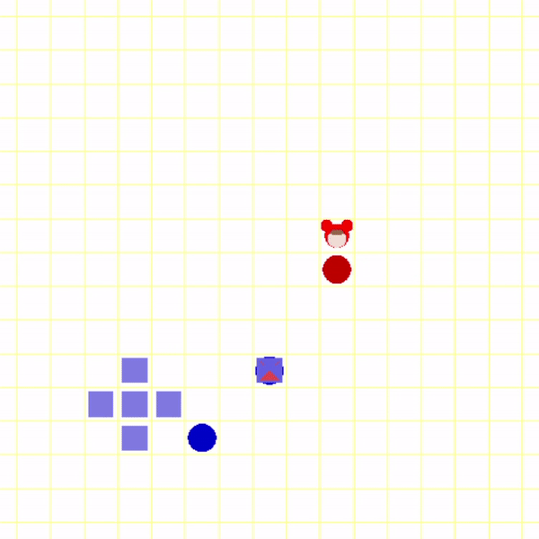

# CrazyArcade

## Introduce


### Contents

- ``OpenGL``을 이용해 넥슨 사의 크레이지 아케이드 게임 만들기
- 캐릭터는 ``A``,``D``,``W``,``S``키를 이용해 움직일수 있다.
- ``SPACEBAR``를 누를 경우 최대 3개 물풍선을 놓을수 있고, 약 3초뒤에 주변에 물줄기를 나타내며 터진다.
- ``OpenGL`` , ``C++`` 사용
- ~~캐릭터는 개발자가 좋아하는 배찌로만 할수 있다.~~

## file tree

```bash
├─basic_setting.cpp
├─basic_setting.h
├─main.cpp
├─npc.cpp
├─npc.h
├─user.cpp
├─user.h
├─water_balloon.cpp
└─water_balloon.h
```

## Demo video



## Schedule
***
- [x] ~~파일 분할~~
- [x] ~~바둑판 배경 생성~~
- [x] ~~배찌 캐릭터 생성~~
- [x] ~~스페이스바를 눌러 물풍선 생성~~
- [x] ~~물풍선 개수 제한 및 터지는 시간 생성~~
- [x] ~~NPC AI 생성~~
- [x] ~~물풍선 물줄기 효과~~
- [ ] NPC 물풍선으로 피해 가능
